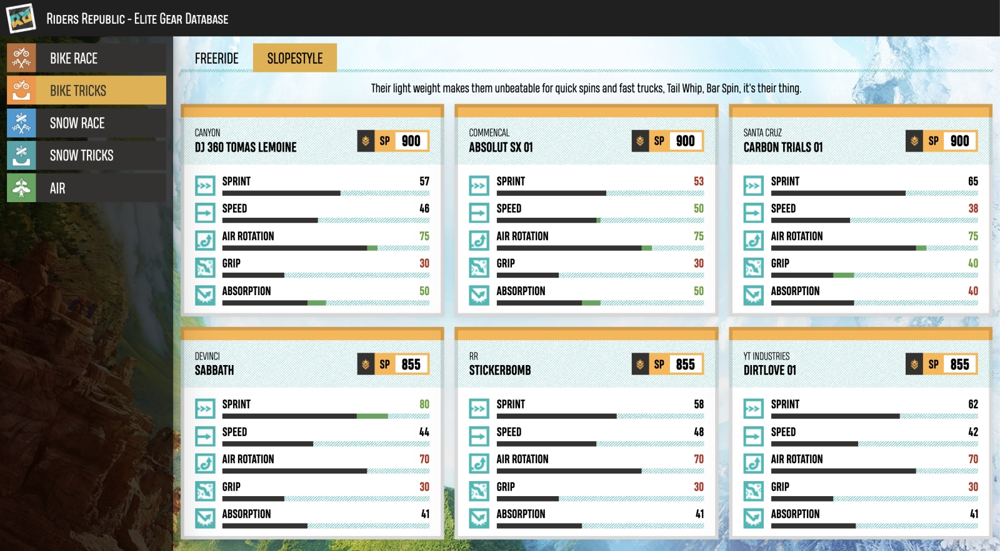

# Riders Republic Elite Gear Database

This is an application that allows you to view and compare all elite gear currently available in the
[Riders Republic](https://www.ubisoft.com/en-gb/game/riders-republic) game.



Simply navigate the gear categories on the left side of the page by clicking on them and choose the
available specializations at the top to compare stats of individual gear items.

Green values represent the best stats within the current specialization whilst the red ones
represent the worst. The difference between the best and second best values within the
specialization are displayed as green tips of the progress bars.

Values that are not yet known are displayed as question marks.

## Development

Start the development server by running the following command:

```bash
pnpm dev
```

## Building

To create a production version of the app run the following command:

```bash
pnpm build
```

You can preview the production build with `pnpm preview`.
